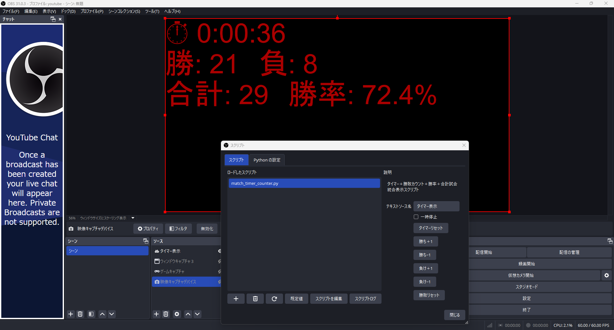

# OBS Match Timer Counter

🎮 OBS配信用｜**タイマー・勝敗・合計試合数・勝率**を1つのテキストソースで表示できるPythonスクリプト！

## 🧠 概要

このスクリプトは、OBS（Open Broadcaster Software）に以下の機能を追加できます：

- ⏱ タイマー（スタート・ストップ・リセット可能）
- 🟢 勝ち数・負け数をボタンで操作
- 📊 合計試合数と勝率を自動計算
- 📺 表示形式は3行に整形され、配信中でも見やすい！

## 🖥 動作環境

- OBS Studio（v27以降推奨）
- Python 3.6（64bit）＋ OBSに連携済であること
- OS：Windows

## 🛠 インストールと使い方

1. `match_timer_counter.py` をダウンロード
2. OBS → [ツール] → [スクリプト] → スクリプトを追加
3. 「テキストソース名」に表示対象のテキストを指定
4. ボタンで勝敗加減、タイマー制御が可能
5. 表示例：
⏱ 0:05:38
勝: 3　負: 1
合計: 4　勝率: 75.0%

## 💡 機能一覧

- [x] タイマー（手動スタート／停止／リセット）
- [x] 勝敗の加算・減算
- [x] 合計試合と勝率の自動計算
- [x] 3行表示の整形済みテキスト出力

## 📷 スクリーンショット

 ← OBSでの実際の表示画像を添付

## 📄 ライセンス

MIT License
